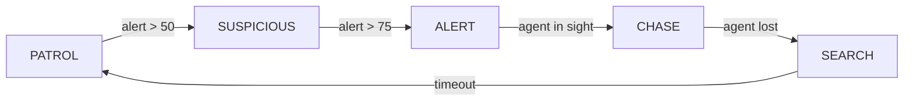

# Documentation Debt

> **Incomplete specifications, missing diagrams, and documentation gaps.**

---

## Purpose

Track documentation work that isn't "done":
- Incomplete specs
- Missing system documentation
- Diagrams that need creation
- Untracked systems
- Orphaned documentation

**This is distinct from technical_debt.md** (code/system issues).

---

## Critical Gaps (Block Phase 2)

### 1. Complete AI Flowchart

**Status:** Missing  
**Impact:** High (AI system needs visual reference)  
**Location:** docs/systems/ai.md

**Requirement:**
- FSM state diagram (PATROL → SUSPICIOUS → ALERT → CHASE)
- Transition conditions (per state)
- Modifiable in Mermaid/PlantUML

**Effort:** 3-4 hours  
**Priority:** Critical (M2-12)  
**Owner:** AI Programmer



**Status:** Sketch only, needs full spec

---

### 2. Perception System Diagram

**Status:** Text description only  
**Impact:** High (complex multi-cone system)  
**Location:** docs/systems/perception.md

**Requirement:**
- Visual: angular cone + distance falloff
- Parameters diagram (angles, ranges, thresholds)
- Pseudocode for detection probability

**Effort:** 4-5 hours  
**Priority:** Critical (M2-12)  
**Owner:** AI Programmer

**Current:** Text → needs visual

---

### 3. Lighting Baking Process

**Status:** Incomplete  
**Impact:** High (central to visual system)  
**Location:** docs/systems/lighting.md

**Missing:**
- Step-by-step baking process
- Cone-to-shadow conversion algorithm
- Performance characteristics
- Cache invalidation rules

**Effort:** 5-6 hours  
**Priority:** High (M2-15)  
**Owner:** Graphics Programmer

---

### 4. Movement System Specification

**Status:** Partially documented  
**Impact:** Medium (core gameplay)  
**Location:** docs/systems/movement.md

**Missing:**
- AP (Action Point) economy edge cases
- Pathfinding edge cases (obstacles, walls)
- Turn timing specification
- Animation sync details

**Effort:** 4-5 hours  
**Priority:** High (M2-15)  
**Owner:** Movement Programmer

---

## Medium Priority (Polish Phase)

### 5. Noise Grid & Audio Propagation

**Status:** Partially documented  
**Impact:** Medium  
**Location:** docs/systems/noise.md

**Missing:**
- Grid decay algorithm (visualization)
- Wall attenuation formula
- Sound propagation examples
- Audio event categories

**Effort:** 3-4 hours  
**Priority:** Medium (M2-16)  
**Owner:** Audio Programmer

---

### 6. Asset Map Completion

**Status:** Started  
**Impact:** Medium (content organization)  
**Location:** docs/technical/ASSET_MAP.md

**Missing:**
- Guard sprite states (full animation map)
- Agent animation states
- Environment props (complete list)
- SFX asset categorization
- Music tracks organization

**Effort:** 4-5 hours  
**Priority:** Medium (M2-15)  
**Owner:** Art Lead

---

### 7. Godot Project Structure

**Status:** Implicit (not documented)  
**Impact:** Medium (onboarding)  
**Location:** docs/technical/godot_setup.md (CREATE)

**Requirement:**
- Folder structure (scenes, scripts, assets)
- Scene organization
- Script dependencies
- Autoload setup
- Export settings

**Effort:** 3-4 hours  
**Priority:** Medium (M2-14)  
**Owner:** Engine Lead

---

### 8. Content Pipeline Completion

**Status:** Started  
**Impact:** Medium  
**Location:** docs/production/animation_pipeline.md (extend)

**Missing:**
- Guard sprite sheet layout
- Agent animation states (full list)
- State-to-animation mapping
- Tweening guidelines (fallback)

**Effort:** 3-4 hours  
**Priority:** Medium (An-01 sprint)  
**Owner:** Animation Director

---

## Low Priority (Later Phases)

### 9. Architecture Document

**Status:** Not started  
**Impact:** Low (understanding long-term)  
**Location:** docs/technical/architecture.md (CREATE)

**Requirement:**
- System dependency graph
- Component interactions
- Data flow (high level)
- Extension points

**Effort:** 5-6 hours  
**Priority:** Low (M3-01 or later)  
**Owner:** Lead Architect

---

### 10. Performance Optimization Guide

**Status:** Not started  
**Impact:** Low  
**Location:** docs/technical/performance.md (CREATE)

**Requirement:**
- Profiling process
- Known bottlenecks
- Optimization checklist
- Mobile target specs

**Effort:** 4-5 hours  
**Priority:** Low (M2-16 at earliest)  
**Owner:** Engine Programmer

---

### 11. Narrative Integration

**Status:** Not started  
**Impact:** Low (future phase)  
**Location:** docs/production/narrative_pipeline.md (extend)

**Missing:**
- Story flow specification
- Dialogue system spec
- Mission structure
- Branching logic

**Effort:** 6-8 hours  
**Priority:** Low (M3-00 or later; Phase 5 work)  
**Owner:** Narrative Designer

---

## Incomplete Specifications

### Systems Missing "Current vs Planned" Sections

| System | Current | Planned | Status |
|--------|---------|---------|--------|
| AI | ✅ | ⏳ Partial | Needs "Future Extensions" |
| Perception | ✅ | ⏳ Partial | Needs "Future Extensions" |
| Lighting | ✅ | ⏳ Missing | Needs "Future Extensions" |
| Movement | ✅ | ⏳ Partial | Needs "Future Extensions" |
| Audio | ⏳ Partial | ⏳ Partial | Needs both |
| Stealth | ✅ | ⏳ Partial | Needs "Future Extensions" |

**Action:** Add "## Future Extensions (M3+)" to each

**Template:**
```markdown
## Current Implementation
[Details of what exists now]

## Planned Extensions
Scheduled for: M3-00 or later
See: docs/production/not_yet_started.md for details
```

---

### Untracked Systems (Exist But Not Documented)

| System | Status | Owner | Effort |
|--------|--------|-------|--------|
| UI Framework | ✅ Implemented | UI Lead | 2h doc |
| Input Handling | ✅ Implemented | Input Programmer | 1h doc |
| Settings/Config | ✅ Implemented | DevOps | 2h doc |
| Save/Load | ✅ Implemented | Gameplay Prog | 2h doc |
| Scene Management | ✅ Implemented | Engine Prog | 2h doc |

**Total Effort:** 9 hours  
**Priority:** Medium (M2-14)  
**Action:** Create minimal docs for each system

---

## Orphaned Documentation

**No references from main docs:**

| Document | Location | Action |
|----------|----------|--------|
| OPERATOR CONTEXT.md | docs/technical/ | Review + decide (keep/archive) |
| Server.rtf | DEVELOPMENT/ | Archive to history |
| Concept/ folder | DEVELOPMENT/ | Archive or migrate |

**Action:** Audit + make explicit decisions

---

## Metrics & Targets

### Current State (M2-12)

| Metric | Current | Target | Status |
|--------|---------|--------|--------|
| Systems documented | 6/6 | 6/6 | ✅ 100% |
| Systems with diagrams | 0/6 | 6/6 | 🔴 0% |
| Systems with "Current vs Planned" | 2/6 | 6/6 | 🟡 33% |
| Missing setup docs | 5+ | 0 | 🔴 |
| Orphaned docs | 3+ | 0 | 🔴 |
| Architecture doc | No | Yes | 🔴 |

### Target State (M2-16)

| Metric | Target | Effort |
|--------|--------|--------|
| Systems documented | 6/6 ✅ | - |
| Systems with diagrams | 6/6 | 15h |
| Systems with "Current vs Planned" | 6/6 | 3h |
| Core setup docs | 4/5 | 10h |
| No orphaned docs | True | 2h |
| Architecture doc started | Partial | 5h |
| **Total Effort** | - | **35 hours** |

---

## Implementation Plan

### This Sprint (M2-12)

- [ ] Create AI flowchart (4h)
- [ ] Create perception diagram (5h)
- [ ] Audit + organize orphaned docs (2h)

**Total:** 11 hours

### Next Sprint (M2-13)

- [ ] Add "Current vs Planned" to all systems (3h)
- [ ] Create setup docs (10h)

**Total:** 13 hours

### Polish Sprint (M2-14/15)

- [ ] Complete asset map (4h)
- [ ] Complete animation pipeline (4h)
- [ ] Performance doc start (3h)

**Total:** 11 hours

---

## Priority Matrix

```
HIGH IMPACT, EASY ↓
- Add "Current vs Planned" sections (3h, blocks understanding)

HIGH IMPACT, MEDIUM
- Flowchart & diagrams (10h, critical for onboarding)
- Complete asset map (5h, needed for production)

HIGH IMPACT, HARD
- Architecture doc (6h, needed for Phase 2 design)

MEDIUM IMPACT, EASY
- Setup docs (10h, helps new devs)
- Orphan cleanup (2h, reduces confusion)

MEDIUM IMPACT, MEDIUM
- Audio propagation doc (4h, nice to have)

LOWER PRIORITY
- Performance guide (5h, M3+)
- Narrative spec (8h, Phase 5)
```

---

## Decision: What to Prioritize

**Recommended Order:**
1. Add "Current vs Planned" to systems (unblock roadmap clarity)
2. Create AI & perception diagrams (critical for M2.02+)
3. Complete asset map (needed for animation sprint)
4. Create setup docs (helps team onboarding)
5. Audit + archive orphans (clean up technical debt)

---

## References

- [Systems Documentation](../systems/) — Current implementations
- [Production Pipeline](development_pipeline.md) — Timeline for doc work
- [Technical Debt](technical_debt.md) — Code-level debt (distinct from doc debt)
- [Not Yet Started](not_yet_started.md) — Features with no doc yet

---

**Last Updated:** 2026-06-12  
**Maintained By:** Docs Lead  
**Review Frequency:** Per-sprint  
**Status:** Active 🟢

**Tracking:** These items feed into sprint planning. Docs are infrastructure.
